# SpellCam — реакции

Открытый бесплатный магазин реакций для видеокружков Telegram: салют, «БАХ!», лазеры
из глаз, аура и всё, что придумаете. Реакции включаются **прямо во время записи** кружка:
кнопкой или жестом в камеру. Показали 👍 — вышло «Да!», сжали кулак — «БАХ!» из кулака,
сложили сердце из ладоней — полетели сердечки.

Здесь только реакции: как они выглядят, как сделать свою и проверить её. Каждая реакция
из этой репы появляется в боте [@spellcambot](https://t.me/spellcambot).

Попробовать без Telegram — песочница: https://motatasher.github.io/spellcam-reactions/ (нужна камера).

## Реакции

|  | 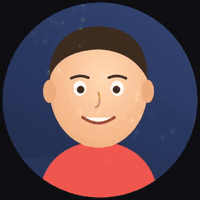 | 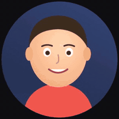 | 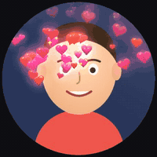 |
|:---:|:---:|:---:|:---:|
| 🎆 **Салют** | 🎉 **Конфетти** | 💖 **Сердечки** | 💸 **Деньги** |
| 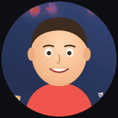 | 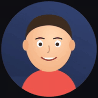 | 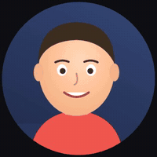 | 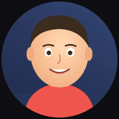 |
| 💥 **БАХ!** | 🪄 **Вжух** | 😍 **ОГО!** | 😂 **ХА-ХА** |
| 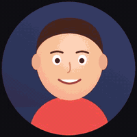 |  | 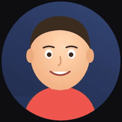 | 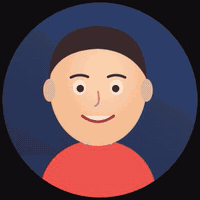 |
| 🔴 **Лазеры** | 🌧️ **Грусть** | 😎 **Очки** | 💀 **Потрачено** |
| 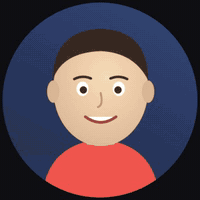 | 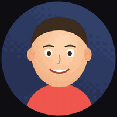 | 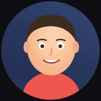 | 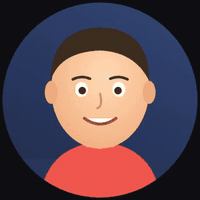 |
| 🎭 **Драма** | ⚡ **Аура** | 🚫 **Нет!** | ✅ **Да!** |
| 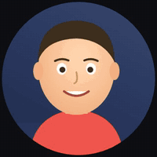 | 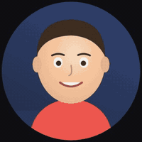 | 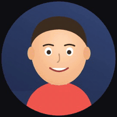 | 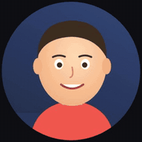 |
| 🥁 **Та-дам** | 🦗 **Сверчки** | 👏 **Браво** | 🔁 **Повтор** |
| 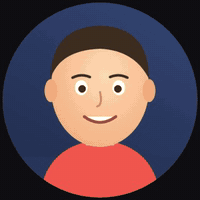 | 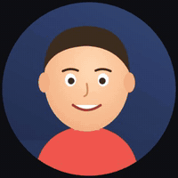 |
| 📸 **Стоп-кадр** | ⏪ **Перемотка** |

У каждой реакции есть звук: он слышен во время записи и попадает в кружок.

**Повтор**, **Стоп-кадр** и **Перемотка** работают со временем: страница помнит последние
секунды камеры, и реакция показывает прошлое: замедленный повтор, застывший кадр,
перемотку назад. Микрофон при этом пишет дальше, так что поверх повтора можно
комментировать.

## Жесты

Жест в камеру — то же, что нажать кнопку реакции. Значок жеста нарисован в углу кнопки.

| жест | | реакция |
|---|:---:|---|
| `Thumb_Up` | 👍 | ✅ Да! |
| `Thumb_Down` | 👎 | 🚫 Нет! |
| `Closed_Fist` | ✊ | 💥 БАХ! — взрыв из кулака |
| `Knock` | ✊ | 💥 БАХ! поменьше — на каждый удар кулаком в воздух, начиная со второго |
| `Open_Palm` | ✋ | 🪄 Вжух — след идёт от ладони над головой |
| `Victory` | ✌️ | 🎆 Салют — ракеты летят из руки |
| `Pointing_Up` | ☝️ | 🥁 Та-дам |
| `Heart` | 🫶 | 💖 Сердечки — из сердца, сложенного ладонями |
| `ILoveYou` | 🤟 | 💖 Сердечки — одной рукой, когда вторая держит телефон |

Чёткий жест срабатывает, как только рука замерла, — примерно за 0,1 с; неуверенный — когда
его подержат четверть секунды. ✋ и 🤟 срабатывают только уверенные и через полсекунды:
ладонью машут, когда говорят. Чтобы повторить тот же жест, опустите руку или смените жест
(и не чаще раза в 2 секунды). Жесты видят обе руки, каждую по отдельности: кулак левой и
кулак правой — одинаковый БАХ.

**Стук.** Постучите кулаком в невидимую стену перед камерой: кулак к камере и обратно.
Первый удар взводит, со второго каждый удар — короткий БАХ из кулака, и чем длиннее серия,
тем он больше. Пауза дольше 1,2 с — серия начинается заново. Кулак, который просто держат,
даёт один большой БАХ, как раньше; пока стучат, большой БАХ не включается.

**Сердце.** Сложите сердце двумя руками — большие пальцы внизу, указательные сверху, —
сердечки полетят из его середины. Пока руки сложены, другие жесты этих рук не срабатывают:
рука в сердце бывает похожа на 👎.

Жесты распознаёт
[MediaPipe Gesture Recognizer](https://ai.google.dev/edge/mediapipe/solutions/vision/gesture_recognizer)
в том же воркере, что и лицо: до двух рук и только внутри круга. Пока рук нет — около 7 раз
в секунду, когда рука в кадре — с частотой камеры (до 30 раз в секунду, на медленных
устройствах реже). Модель (8 МБ) грузится после лица и камеру не задерживает.
Кнопка ✋ в углу круга выключает жесты (запоминается), `?nogestures` в адресе — тоже.

Каждая реакция — отдельный файл в [`effects/`](effects/). Добавить свою — ниже.

## Песочница у себя

```sh
python3 server.py     # http://127.0.0.1:8765
```

Пробел — запись, 1–0, q–p, a и s — реакции. Реакции рисуются на canvas 2D, лицо и силуэт
находит [MediaPipe](https://ai.google.dev/edge/mediapipe/solutions/vision/face_detector)
прямо в браузере, сборки нет. `./tools/vendor.sh` один раз скачает MediaPipe и модель
жестов локально (без него они грузятся с jsDelivr и storage.googleapis.com).

## Сделать свою реакцию

1. Скопируйте [`effects/_template.js`](effects/_template.js) в
   `effects/<id>.js`.
2. Допишите строчку в [`effects/index.js`](effects/index.js):
   импорт и место в массиве `EFFECTS` (порядок = порядок кнопок).
3. Проверьте глазами на http://127.0.0.1:8765 и пришлите PR. Имя файла =
   `id` реакции. В PR сам запустится [GitHub Actions](.github/workflows/reactions.yml):
   прогонит все реакции на мультяшном лице (не падает, заканчивается за 15 секунд,
   держит кадр) и приложит GIF-превью вашей реакции во вложениях к проверке.
   Локально то же самое: `CHROME=… node tools/check.mjs [id]`. Жесты проверяет
   `CHROME=… node tools/gesture-check.mjs`: собирает видео из фото (нужен ffmpeg) и ждёт,
   что 👍 ✌️ ☝️ 👎, ✊ обеими руками, 🫶, 🤟 и стук кулаком вызовут свои реакции сколько
   надо раз и быстро. Логику жестов без браузера и камеры проверяет
   `node tools/spells-test.mjs`: она лежит в [`spells.js`](spells.js).

Эффект — объект `{ id, name, emoji, author, face, gesture, make }` (`author` — ваш ник на
GitHub, по желанию; `face: true` — эффекту нужно лицо, пока он идёт, лицо
отслеживается чаще; `gesture` — жест, которым реакция вызывается, по желанию: одно из
`Thumb_Up`, `Thumb_Down`, `Closed_Fist`, `Open_Palm`, `Victory`, `Pointing_Up`, `ILoveYou`,
`Knock` (стук кулаком), `Heart` (сердце из ладоней) или массив из нескольких, у каждого
жеста одна реакция; значок на кнопке — от первого). `make(env, hand)` вызывается при каждом
нажатии и возвращает экземпляр эффекта. `hand` — рука, которая показала жест (`{ id, x, y,
size, gesture, wrist }`, как в `env.hands` в момент жеста), или `null`, если нажали кнопку.
Для `Heart` это середина сердца (`size` — его полуширина), для `Knock` — кулак в момент
удара и `knock` — номер удара в серии (2, 3, …). С рукой эффект может вылететь из неё, без
руки он должен выглядеть как раньше:

```js
function bam(env, hand) {
  const f = faceOrDefault(env);
  const x = hand ? hand.x : f.box.x + f.box.w / 2;
  …
```

| поле | обязательно | что делает |
|---|---|---|
| `update(dt, env)` | да | шаг анимации, `dt` в секундах |
| `draw(ctx, env)` | да | рисует поверх кадра |
| `done` | да | `true`, когда эффект закончился (обычно геттер) |
| `shake()` | нет | `{x, y}` — сдвиг всего кадра (тряска) |
| `filter()` | нет | строка CSS-фильтра для кадра камеры: `grayscale(.8)` |
| `zoom(env)` | нет | `{ s, x, y, tx?, ty?, rot? }` — наезд камеры: масштаб `s` вокруг точки `(x, y)`, которая переезжает в `(tx, ty)`; края кадра не открываются |
| `base(ctx, env)` | нет | рисует сразу после кадра, до остальных эффектов (фон, свечение за человеком) |
| `overlay(ctx, env)` | нет | рисует поверх всего, без тряски (вспышка) |
| `needsMask` | нет | `true` — пока эффект идёт, включается маска человека |
| `sound(audio)` | нет | звук реакции: вызывается один раз при нажатии, `audio = { ac, out }` — `AudioContext` и узел, куда подключать. Звук попадает в кружок вместе с голосом и слышен во время записи |
| `source(env)` | нет | кадр вместо живой камеры на этот кадр: canvas любого размера (растянется на C×C) или `{ canvas, face }`, тогда остальные эффекты видят в `env.face` лицо из показанного кадра (если `face` пустое, остаётся живое). `null` — живая камера. Если кадр подменяют несколько эффектов, побеждает нажатый последним. Фильтры, наезд, тряска, `base`, `draw` и `overlay` работают поверх; маска и `edgePoint` остаются живыми |

`env`:

| поле | что это |
|---|---|
| `C` | сторона кадра в пикселях (640) |
| `face` | `{ eyes: [{x,y},{x,y}], box: {x,y,w,h} }` или `null`, координаты уже в кадре. Пока какой-то эффект подменяет кадр через `source`, здесь лицо из показанного кадра |
| `hand` | главная рука в кадре: `{ id, x, y, size, gesture, wrist: {x,y} }` или `null`. `x, y` — центр ладони, `size` — размер руки, `gesture` — жест, который в ней видно (`None`, если никакой). Главная — та, что последней включила жест; если её нет — та, что показывает жест, или самая крупная. Сглажена; `null`, если рук нет или жесты выключены |
| `hands` | все руки в кадре (до двух), такие же объекты; `id` у руки не меняется, пока она в кадре |
| `mask` | canvas C×C, альфа = человек (только при `needsMask`) |
| `frame` | canvas C×C с чистым кадром камеры, всегда живым |
| `history(sec)` | кадр камеры `sec` секунд назад: `{ canvas, face, ago }` — ближайший запомненный кадр, его лицо и точный возраст в секундах, или `null`, если камера ещё ничего не показала. Кадр чистый, без эффектов, уменьшен вдвое (сторона C/2), рисовать растянутым на C×C; `face` в координатах кадра. Помнятся последние ~3,5 секунды, 15 кадров в секунду. Canvas потом перезаписывается, поэтому его запрашивают заново каждый кадр, а не хранят |
| `historySpan` | сколько секунд прошлого уже есть: сразу после включения камеры меньше, чем нужно реакции, и она должна это пережить |
| `layer(i)` | запасной canvas C×C (0 и 1) для своих слоёв |
| `edgePoint()` | случайная точка на контуре человека или `null` |

В [`effects/lib.js`](effects/lib.js) лежат помощники: `rand`, `pick`, `clamp`,
`envelope` (плавное появление и исчезание), `easeOutBack`, `drawGlow` (быстрое
свечение спрайтом, хорошо с `ctx.globalCompositeOperation = 'lighter'`),
`emojiSprite`, `heart`, `faceOrDefault` (лицо или разумное место по центру,
если лица нет).

Звуки синтезируются кодом, файлов нет. В [`effects/sfx.js`](effects/sfx.js):
кирпичики `tone(audio, { type, from, to, curve, dur, gain, filter, vibrato, … })` и
`noise(audio, { dur, gain, filter, … })`, и готовые звуки — `boom`, `hit`, `pop`,
`whoosh`, `sparkle`, `chime`, `tada`, `fireworks`, `cash`, `zap`, `hum`, `boing`,
`laugh`, `sadTrombone`, `dunDunDun`, `riff`, `wasted`, `powerUp`, а для реакций со
временем `sting` (заставка повтора), `slowMo`, `scratch` (пластинка), `whir`, `clunk`
и `tapeStart` (видеомагнитофон). Все принимают
`(audio, at)` — задержку в секундах от нажатия, так что звук можно собрать из
нескольких: `sound(a) { whoosh(a); sparkle(a, 0.22); }`. Послушать все звуки без
камеры: `CHROME=… node tools/sounds.mjs папка` — сложит WAV по одному на реакцию.

Несколько правил, чтобы эффекты уживались:

- всё в координатах кадра `C × C`, размеры от `C`, а не в пикселях: кадр могут
  поменять;
- `ctx.save()` / `ctx.restore()` вокруг своего рисования;
- эффект конечный: 2–6 секунд, потом `done`; звук — до 6 секунд и без клиппинга
  (пик до 1.0), проверка это меряет;
- эффекты можно жать по несколько сразу, поэтому не трогайте общее состояние;
- без внешних картинок и шрифтов из сети: рисуйте кодом или эмодзи;
- держите 60 fps на ноутбуке: сотни частиц нормально, тысячи с `shadowBlur` уже нет.

Превью для README (мультяшное лицо вместо камеры): `CHROME=… node tools/previews.mjs [id …]`.

Скриншоты всех эффектов без камеры (headless Chrome с подставной камерой):

```sh
npm i
python3 server.py &
CHROME="/путь/к/chrome" npm run shots          # или: npm run shots -- bam aura
```

## Лицензия

MIT. Модели в `models/` и модель жестов `gesture_recognizer.task` (страница берёт её с
storage.googleapis.com или из `vendor/`) — [MediaPipe](https://github.com/google-ai-edge/mediapipe)
от Google, Apache 2.0. Фото для `tools/gesture-check.mjs` в репе не лежат: это примеры
MediaPipe и два фото с [Wikimedia Commons](https://commons.wikimedia.org/) (CC BY-SA 4.0),
скрипт скачивает их сам.
